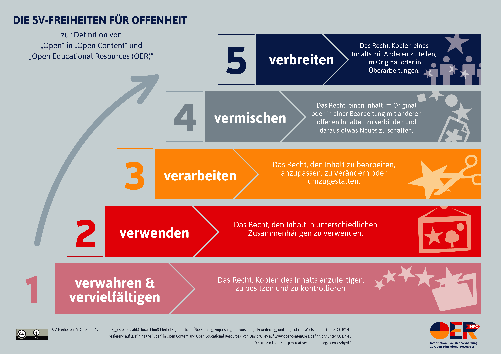

# Open Educational Resources: Begriff, Status und Lizenzen

Unter _Open Educational Ressources_ werden Lern- und Lehrmaterialien
verstanden, die unter einer freien Lizenz stehen und in der Regel digital
vorliegen. Von zentraler Bedeutung ist, dass die freien Lizenzen nicht nur den
kostenlosen Zugang erlauben (Verfügbarkeit), sondern auch die Verwendung in
unterschiedlichen Kontexten, die Veränderung und die Weiterverbreitung. OER
ordnen sich damit generell ein in die Idee und Definition von "Open Content"
(siehe Wiley, o.D.). Danach müssen OER fünf Verwendungen (die sogenannten "5R")
erlauben, um als offen (frei) zu gelten: _Retain_ (Verwahren und
Vervielfältigen), _Reuse_ (Verwenden), _Revise_ (Verarbeiten), _Remix_
(Vermischen), _Redistribute_ (Verbreiten) (siehe zur deutschen Übersetzung
ausführlicher Muuß-Merholz, 2015).

<!-- aus Platzgründen weggelassen; für Veröffentlichung wieder reinnehmen!

-->

OER sind "Teil einer größeren Bewegung, die das 'Open' als Ausgangspunkt für
einen neuen Umgang mit Informationen nimmt" (Muuß-Merholz, 2018, S. 45). Dazu
gehört in erster Linie sicher die _Open Source_ Bewegung (Software), die als eine
wesentliche Basis der 'Openness'-Bewegung gesehen werden kann, für den
Wissenschaftsbereich die _Open Access_ Bewegung, die freien Zugang zu allen
wissenschaftlichen Veröffentlichungen anstrebt (siehe dazu grundlegend: Suber
2012) und neuerdings auch die _Open Science_ Bewegung, die die Öffnung von
Wissenschaft ausdehnen möchte auf alle Produkte (auch Forschungsdaten),
Erkenntnisse und Arbeitsprozesse im wissenschaftlichen Forschungs- und
Publikationsprozess (siehe dazu bspw. Heise, 2017), wie auch die noch junge
_Open Data_ Bewegung, die eine Öffnung und Verwendbarkeit für alle Arten von
öffentlichen ("governmental") Daten fordert.

Als Urheber des Begriffs _Open Educational Resources_ kann die UNESCO gelten
(UNESCO, 2002, S. 24), die auch heute noch als "Treiber weltweiter Diskussionen
gilt" (siehe hierzu und dem folgenden Muuß-Merholz, 2018, S. 40f.). Inzwischen
bekennen sich bspw. auch die EU-Kommission und die OECD zu OER (ebd., S. 41).
Anders als bspw. in den USA, wo die OER-Bewegung schnell wuchs und Einfluss
gewann, waren freie Lern- und Lehrmaterialien in Deutschland lange kaum ein
Thema. Erst seit etwa 2012 werden auch hier verstärkt Diskussionen über OER
geführt und das Thema wird inzwischen staatlicherseits intensiv gefördert.
Ausdruck fand das in den oben bereits genannten Aussagen der Koalitionsverträge
von 2013 und 2017, und auch in den meisten Bundesländern wurde das Thema
aufgegriffen, wie eine Studie bereits 2015 zeigte (Ebner et al., 2015). In
Bremen waren OER 2013 Thema einer Kleinen Anfrage der SPD-Fraktion in der
Bürgerschaft (Bremische Bürgerschaft, 2013).

Um der bis dato trotz zahlreicher politischer Empfehlungen nur sehr geringen
Rezeption und Umsetzung von OER in den Bildungsinstitutionen selbst
entgegenzuwirken, schrieb das Bundesministerium für Bildung und Forschung
(BMBF) im Januar 2016 eine "Richtlinie zur Förderung von Offenen
Bildungsmaterialien (Open Educational Resources - OERInfo)" aus (BMBF, 2016).
Die Förderrichtlinie zielte "auf die breite Sichtbarmachung der mit OER
verbundenen Potenziale und auf den Aufbau von Kompetenzen zur Nutzung,
Erstellung und Verbreitung von offenen Bildungsmaterialien." (ebd.). Mit dieser
Förderrichtlinie wurden bis zum 30.9.2018 insgesamt 24 Projekte gefördert, die
im Kern darauf zielten, Multiplikatoren und Multiplikatorinnen aus den
Bildungsbereichen Schule, Hochschule, Weiterbildung und Berufsbildung für die
Erstellung und Nutzung von OER zu qualifizieren (Synergie 2018, S. 8-9, 18).
Eines dieser Projekte war _edulabs_ ("Dokumentation der Projekte der OERInfo
2017/2018", 2018, S. 222-231), das über das Thema OER hinaus "didaktische,
technische und gestalterische Fähigkeiten für offene Bildung" bündeln will
(ebd. S. 222) und außerdem eine Sammlung von OER Materialien und
Unterrichtsideen aufgebaut hat
([https://edulabs.de/oer](https://edulabs.de/oer)). Der Autor dieser Arbeit war
als 'Multiplikator' an diesem Projekt beteiligt (s.u.).

Um als OER zu gelten, muss eine Ressource eine freie Lizenz verwenden (siehe zum
folgenden ausführlich Kreutzer, 2016, S. 29ff., und Muuß-Merholz, 2018, S.
47ff.). OER Materialien unterstehen natürlich auch dem Urheberrecht, d.h. ihre
urheberrechtlichen Bestimmungen müssen vom Urheber festgelegt werden. "Freie
Lizenzen sind (...) eine Krücke, um das Vorankommen im widrigen Feld des
Urheberrechts ein Stück weit zu erleichtern" (Muuß-Merholz, 2018, S. 47). Für
OER wie auch generell für viele Nicht-Software-Ressourcen (Text, Audio, Video,
Bild etc.) haben sich die _Creative Commons_ Lizenzen (CC) inzwischen als
de-facto Standard etabliert. Die CC-Lizenzen sind modulartig aufgebaut, die
Module können kombiniert werden, so dass die Nutzer sich eine für sie passende
Lizenz wählen können. Sie gelten, das ist für juristische Laien wie Lehrerinnen
und Lehrer bedeutsam, als _rechtssicher_, d.h. sie sind solide und
verlässliche sowie weltweit gültige Vertragsgrundlage (Muuß-Merholz 2018, S.
56).
