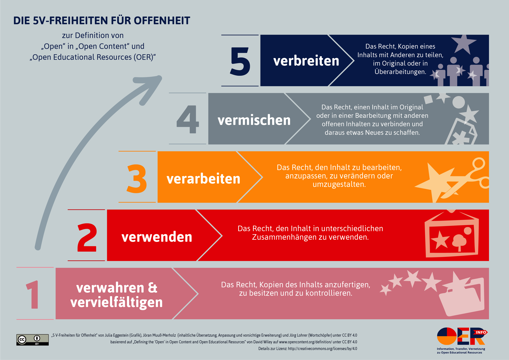

# 2.    Open Educational Resources

Unter _Open Educational Ressources_ werden Lern- und Lehrmaterialien
verstanden, die unter einer freien Lizenz stehen und in der Regel digital
vorliegen. Von zentraler Bedeutung ist, dass die freien Lizenzen nicht nur den
kostenlosen Zugang erlauben (Verfügbarkeit), sondern auch die Verwendung in
unterschiedlichen Kontexten, die Veränderung und die Weiterverbreitung. OER
ordnen sich damit generell ein in die Idee und Definition von "Open Content"
ein (Defining the "Open" in Open Content and Open Educational Resources,
http://www.opencontent.org/definition/), die im deutschen mit folgender Grafik
dargestellt werden kann.

<!-- ggf. den Inhalt lieber als Liste und Zitat rein; Zitat nach Muuß-Merholz 2018, S. 42f. -->

OER sind "Teil einer größeren Bewegung, die das 'Open' als Ausgangspunkt für
einen neuen Umgang mit Informationen nimmt" (Muuß-Merholz 2018, S. 45). Dazu
gehört in erster Linie sicher die _Open Source_ Bewegung (Software), die als eine
wesentliche Basis der 'Openness'-Bewegung gesehen werden kann, für den
Wissenschaftsbereich die _Open Access_ Bewegung, die freien Zugang zu allen
wissenschaftlichen Veröffentlichungen anstrebt (siehe dazu grundlegend: Suber
2012) und neuerdings auch die _Open Science_ Bewegung, die die Öffnung von
Wissenschaft ausdehnen möchte auf alle Produkte (auch Forschungsdaten),
Erkenntnisse und Arbeitsprozesse im wissenschaftlichen Forschungs- und
Publikationsprozess (siehe dazu bspw. Heise 2017), wie auch die noch junge
_Open Data_ Bewegung, die eine Öffnung und Verwendbarkeit für alle Arten von
öffentlichen ("governmental") Daten fordert.

<!-- Geschichte und Status in Deutschland -->

Als Urheber des Begriffs _Open Educational Resources_ kann die UNESCO gelten
(UNESCO 2002, S. 24), die auch heute noch als "Treiber weltweiter Diskussionen
gilt" (siehe hierzu und dem folgenden Muuß-Merholz 2018, S. 40f.). Inzwischen
bekennen sich bspw. auch die EU-Kommission und die OECD zu OER (ebd., S. 41).
Anders als bspw. in den USA, wo die OER-Bewegung schnell wuchs und Einfluss
gewann, waren freie Lern- und Lehrmaterialien in Deutschland die ersten zehn
Jahre kaum ein Thema. Erst seit etwa 2012 werden auch hier verstärkt
Diskussionen über OER geführt[^1] und das Thema wird inzwischen
staatlicherseits intensiv gefördert. Ausdruck fand das in den oben bereits
genannten Aussagen der Koalitionsverträge von 2013 und 2017, und auch in den
meisten Bundesländern wurde das Thema aufgegriffen, wie eine Studie bereits
2015 zeigte (Ebner et. al. 2015.). In Bremen waren OER 2013 Thema einer Kleinen
Anfrage der SPD-Fraktion in der Bürgerschaft (Bürgerschaft 2013) <!-- muss
vielleicht nicht rein -->.

Um der bis dato trotz zahlreicher politischer Empfehlungen nur sehr geringe
Rezeption und Umsetzung von OER in den Bildungsinstitutionen selbst
entgegenzuwirken, schrieb das BMBF im Januar 2016 eine "Richtlinie zur
Förderung von Offenen Bildungsmaterialien (Open Educational Resources -
OERInfo)" aus (<!--Quelle:
https://www.bmbf.de/foerderungen/bekanntmachung-1132.html --> ). Die
Förderrichtlinie zielte "auf die breite Sichtbarmachung der mit OER verbundenen
Potenziale und auf den Aufbau von Kompetenzen zur Nutzung, Erstellung und
Verbreitung von offenen Bildungsmaterialien." (ebd.). Mit dieser
Förderrichtlinie wurden bis zum 30.9.2018 insgesamt 24 Projekte gefördert, die
darauf zielten, Multiplikatoren und Multiplikatorinnen aus den
Bildungsbereichen Schule, Hochschule, Weiterbildung und Berufsbildung für die
Erstellung und Nutzung von OER zu qualifizieren (Synergie 2018, S. 8-9, 18).

Didaktische/Pädagogische/schulische Einordnung: Mehrwert!
1. der praktische Mehrwert: Suche, Zettel, Arbeitserleichterung
2. der pädagogische Mehrwert:

Praktische Probleme?
Politische und rechtliche Probleme, auch : Lizenzen

## Fußnoten

[^1]: Anlass war auch ... (Bildungstrojaner)
